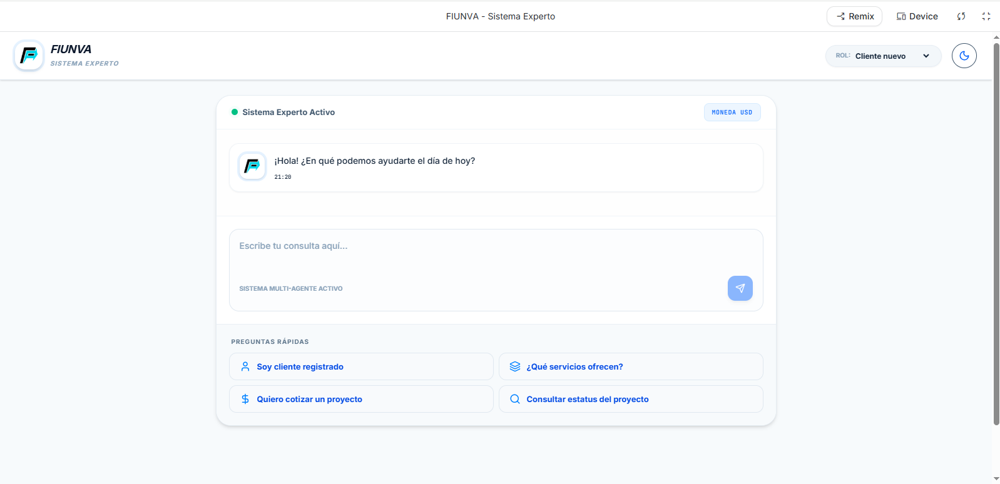
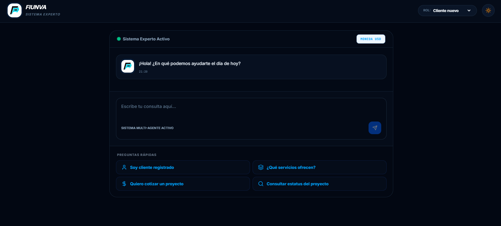
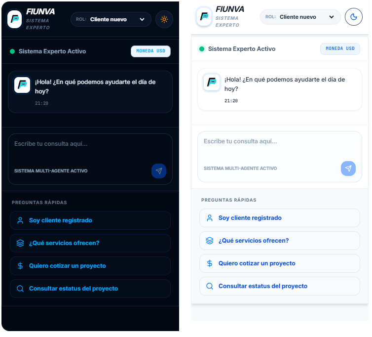
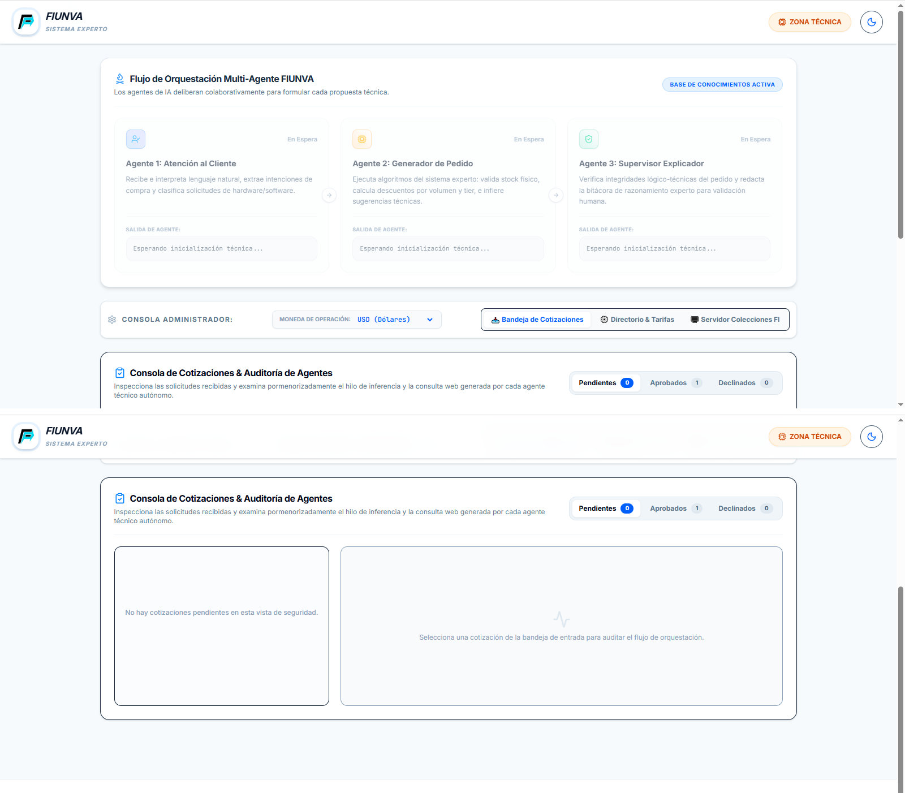
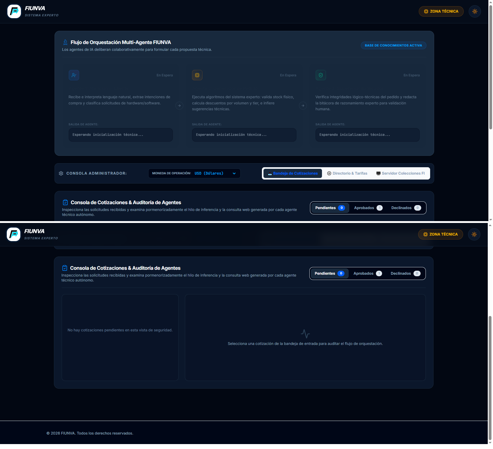
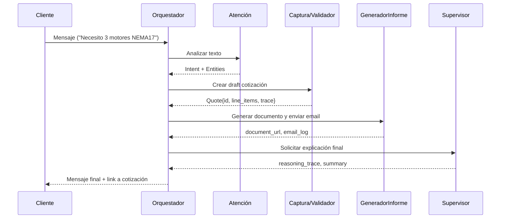

**SE-FIUNVA — Sistema Experto FIUNVA**

**Resumen:**
- **Objetivo:** Desarrollar un sistema experto moderno basado en agentes inteligentes capaces de interactuar con clientes, realizar inferencias y automatizar procesos de venta o soporte mediante IA para proyectos de electrónica, software y robótica.

**Concepto de Marca:**
- **Nombre formal:** SE-FIUNVA, abreviatura de Sistema Experto FIUNVA.
- **Juego conceptual:** El nombre se puede leer como “se FIUNVA”, reforzando la idea de que la plataforma no solo representa a la marca, sino que también se expresa como una acción: FIUNVA se activa, atiende, infiere y propone.
- **Intención del naming:** Crear una identidad técnica y recordable que conecte con consultoría tecnológica, ingeniería y automatización, evitando que el proyecto se perciba como un chatbot genérico.

**Propuesta Evolutiva del Proyecto:**
- **Nombre:** FIUNVA Nexus o FIUNVA Expert System (FES).
- **Enfoque:** No limitar el sistema a un chatbot comercial. La propuesta debe convertirse en una plataforma de valor real para FIUNVA, capaz de atender clientes de ingeniería, cotizar, generar propuestas técnicas, gestionar proyectos, dar soporte postventa y explicar decisiones e inferencias.
- **Beneficio principal:** El proyecto académico queda alineado con una herramienta reutilizable por la marca.

**Alcance e Integraciones:**
- **Incluye:** Ingeniería del conocimiento, sistemas expertos, motores de inferencia, bases de datos, agentes inteligentes, IA moderna, explicabilidad del razonamiento y arquitectura cliente-servidor o local.

**Requerimientos Generales:**
- **Ejecución local:** El proyecto debe poder ejecutarse de forma LOCAL en una computadora personal.
- **Herramientas permitidas (ejemplos):** Python, FastAPI, Flask, Streamlit, Gradio, SQLite, MongoDB Atlas, Supabase, Ollama, LangChain, CrewAI, OpenRouter, HuggingFace, Gemini API.

**Arquitectura Recomendada:**
- **Descripción:** Sistema multi-agente con al menos 3 agentes colaborando entre sí y una base de datos central para persistencia.
- **Agentes mínimos obligatorios:**
  - **Agente 1 — Atención al Cliente:**
    - **Funcionalidad:** Leer mensajes de clientes, detectar intención, extraer información relevante y responder automáticamente.
    - **Ejemplo:** Cliente: “Hola, necesito 3 motores NEMA17 y 2 drivers.” → El agente debe interpretar cantidad, producto y posibles aclaraciones.

  - **Agente 2 — Generador de Pedido:**
    - **Funcionalidad:** Procesar la información recibida, validar datos, realizar inferencias (reglas), generar el pedido y guardar en la base de datos.
    - **Ejemplo de regla:** IF stock < cantidad_solicitada THEN sugerir reabastecimiento.

  - **Agente 3 — Supervisor / Explicador:**
    - **Funcionalidad:** Generar resumen de la venta, explicar decisiones e inferencias realizadas y solicitar validación final al usuario o operador.
    - **Ejemplo:** “Se detectó que el cliente solicitó 3 motores NEMA17. Existe stock suficiente. Se aplicó descuento por cliente frecuente.”

- **Arquitectura ampliada recomendada para FIUNVA:**
  - **Frontend:** React Web App con Firebase Hosting y Firebase Auth.
  - **Backend:** Firebase Functions con lógica de negocio y orquestación de agentes.
  - **IA:** Gemini 2.5 Flash para atención y clasificación; Gemini 2.5 Pro para propuestas complejas y análisis avanzado.
  - **Persistencia:** Firestore como base de datos principal.
  - **RAG:** Firestore + embeddings + vector search para consultar proyectos previos, documentación FIUNVA, plantillas y procedimientos.
  - **Flujo general:** Cliente -> React Web App -> Firebase Hosting -> Firebase Functions -> Agentes -> Gemini -> Firestore.

**Tema del Proyecto:**
- **Áreas sugeridas (no limitadas):** Ventas, diagnóstico, atención al cliente, soporte técnico, mantenimiento, medicina, automatización, educación, robótica, electrónica, mecatrónica.

**Plataformas de Integración:**
- Telegram, WhatsApp, Instagram, Facebook Messenger, Discord, página web con chatbot, aplicación Android/iOS.

**Base de Datos:**
- **Requisito:** El sistema DEBE conectarse a una base de datos.
- **Opciones sugeridas:** SQLite, PostgreSQL, MongoDB, Firebase, Supabase.
- **Fuentes de datos permitidas:** Datasets descargados, HuggingFace, Kaggle.

**Base de Conocimiento FIUNVA:**
- El sistema debe conocer, como mínimo, los siguientes dominios de conocimiento:
  - **Servicios:** Diseño PCB, Firmware embebido, ESP32, STM32, Arduino, sistemas IoT, automatización, robótica, diseño mecánico, impresión 3D e integración de sensores.
  - **Productos:** Prototipos, PCB, sistemas electrónicos y equipos de automatización.
  - **Clientes:** Universidades, empresas, emprendedores y makers.
  - **Proyectos:** Cotizaciones, seguimiento, desarrollo y entrega.

**Ingeniería del Conocimiento:**
- La base de reglas debe existir como conocimiento explícito y no solo como texto dentro de prompts.
- Ejemplos de reglas:
  - IF cliente solicita PCB THEN asignar área electrónica.
  - IF cliente solicita ESP32 THEN recomendar firmware embebido.
  - IF proyecto incluye IoT THEN agregar módulo nube.
  - IF cliente es recurrente THEN aplicar descuento.
  - IF tiempo estimado > 4 semanas THEN requerir anticipo.
- **Sugerencia de almacenamiento:** Colección `rules` en Firestore.

**Colecciones sugeridas en Firestore:**
- `users`
- `clients`
- `projects`
- `quotes`
- `rules`
- `knowledge_base`
- `conversations`

**Ejemplos de documentos:**
- `clients`:

```json
{
  "name": "Empresa XYZ",
  "type": "Empresa",
  "recurrent": true
}
```

- `projects`:

```json
{
  "title": "PCB Control Motores",
  "status": "Cotización"
}
```

- `rules`:

```json
{
  "id": "R001",
  "condition": "cliente_recurrente",
  "action": "descuento_10"
}
```

- `knowledge_base`:

```json
{
  "service": "Diseño PCB",
  "estimated_hours": 40,
  "complexity": "Media"
}
```

**Requisito IMPORTANTE — GitHub:**
- **Obligatorio:** Subir el trabajo continuamente a GitHub con commits diarios y evidencia del desarrollo.
- **No se aceptará:** Repositorios con un solo commit, commits masivos al final o repositorios vacíos. El historial será parte de la evaluación.

**Entregables (obligatorios):**
- **1. Repositorio GitHub:** Código fuente, README (actual), instrucciones básicas y evidencia continua del desarrollo.
- **2. Documento PDF:** Nombre: `GG_registro_Proy.pdf`. Debe incluir: portada, objetivo, descripción del sistema, arquitectura, base de conocimiento, inferencias utilizadas, explicación de agentes, capturas del sistema, base de datos utilizada, herramientas usadas y conclusiones.
- **3. Manual de Usuario:** Incluir dentro del PDF un manual completo con instrucciones para instalar, configurar dependencias, ejecutar agentes, conectar base de datos, ejecutar inferencias y uso del sistema. Debe ser replicable desde cero.
- **4. Video demostrativo:** Subir a YouTube mostrando el proyecto, agregar enlace dentro del PDF.
- **5. Prototipado UI (entrega posterior):** Diseño UI/UX, prototipo, flujo de interacción, mockups o implementación visual.

**Requisitos Técnicos Mínimos (a demostrar):**
- Conexión a base de datos.
- Inferencias y reglas demostrables.
- Explicabilidad del razonamiento (registro/explicaciones generadas por el agente supervisor).
- Interacción usuario-sistema (chatbot o UI).
- Arquitectura funcional (cliente-servidor o local).

**Sugerencia de Stack Inicial (ejemplo práctico):**
- **Frontend:** React + Firebase Hosting.
- **Backend / Agentes:** Firebase Functions con Python o Node.js para orquestación.
- **Persistencia:** Firestore como base principal; alternativas permitidas: SQLite, PostgreSQL o MongoDB.
- **IA / Razonamiento:** Gemini 2.5 Flash y Gemini 2.5 Pro, con apoyo de LangChain si se requiere orquestación híbrida.
- **Motor de inferencia:** Reglas explícitas almacenadas en Firestore y aplicadas por un agente especializado.

**UI/UX en desarrollo:**
- La interfaz actual está construida en React con Vite y un sistema visual responsivo pensado para operación local y futura conexión con Firestore/Firebase.
- El diseño usa modo claro/oscuro, tipografías limpias y un estilo de consola técnica para comunicar que el sistema es una herramienta de ingeniería y no un chatbot genérico.
- La navegación principal se divide en dos experiencias: **vista de cliente** y **consola de administrador**.
- En la **vista de cliente** se trabaja un chat de consultas con mensajes tipo burbuja, sugerencias rápidas, validación de cliente registrado, selección de tipo de cliente y despliegue del estado de la interacción en tiempo real.
- La sección de cliente permite simular el flujo de atención, captura de solicitud, respuesta automática y explicación del sistema experto.
- En la **consola de administrador** se concentra el control operativo del sistema: bandeja de cotizaciones, directorio técnico del catálogo, visualizador de colecciones y flujo de agentes.
- La consola administrativa está pensada para auditar solicitudes, aprobar o rechazar cotizaciones, ajustar tarifas, editar referencias técnicas y revisar documentos persistidos.
- El componente de **flujo de agentes** muestra el razonamiento paso a paso de Atención al Cliente, Generador de Pedido y Supervisor Explicador.
- El componente de **bandeja de cotizaciones** permite inspeccionar el historial, detalle de componentes, descuentos, impuestos y trazabilidad de inferencias.
- El componente de **directorio técnico** permite mantener el catálogo maestro de componentes y servicios, incluyendo edición de nombres, precios, descripciones y enlaces de referencia web.
- El componente de **visualización de base de datos** expone colecciones tipo Firestore en formato legible para fortalecer la trazabilidad y el entendimiento técnico del sistema.
- La experiencia actual también contempla estados de cliente nuevo, integrado y registrado, con validación simple de código de cliente y descuentos diferenciados.
- A nivel visual, la interfaz está orientada a una presentación de consultoría tecnológica: limpia, técnica, densa en información útil y enfocada en explicar decisiones.
- Esta capa UI/UX debe verse como prototipo funcional y base de la futura entrega de prototipado visual, mockups y refinamiento de interacción.

**Informe de prototipado y diseño de interfaz:**

El prototipado del Sistema Experto FIUNVA se planteó como una fase previa a la implementación definitiva para validar la navegación, la jerarquía de la información y la interacción entre cliente y administrador antes de consolidar la capa de producción. La prioridad fue convertir ideas abstractas en una interfaz tangible, útil para revisar la experiencia del usuario, detectar fricción temprana y mantener coherencia entre el discurso técnico del proyecto y su comportamiento visual.

**Objetivo del prototipado:**
- Reducir el costo de cambio detectando problemas de flujo antes de la entrega final.
- Validar que el modelo mental del usuario coincida con la lógica del sistema experto.
- Alinear al equipo de desarrollo con una misma referencia visual y funcional.
- Confirmar que las interacciones principales se puedan traducir a lógica real en React y backend.

**Criterio de diseño adoptado:**
- Se eligió una estética industrial y sobria, con contraste controlado, para reforzar el carácter técnico de FIUNVA.
- Se priorizó una interfaz de alta legibilidad, con tipografía clara y componentes visuales que separan con precisión las áreas de consulta, administración y auditoría.
- Se evitó el enfoque de maqueta estática; la interfaz se desarrolló como prototipo vivo para probar acciones reales sobre datos, catálogo y cotizaciones.

**Justificación tecnológica del prototipado en código:**
- En este proyecto, el prototipado se realizó directamente sobre la base de una aplicación React con servidor Express, por lo que la interfaz no solo muestra pantallas, sino que ejecuta lógica real.
- Este enfoque permite validar formularios, filtros, cambios de estado, consultas de catálogo y auditoría sin depender de diagramas desconectados del sistema.
- La ventaja principal es que el diseño visual y la lógica funcional evolucionan juntos, reduciendo la brecha entre diseño y desarrollo.

**Flujo de planificación de interfaz:**

```text
[Definición de Requerimientos] -> [Maquetación de Arquitectura] -> [Identidad Visual y Tipografía] -> [Iteración y Validación de Roles]
```

**Estructura visual del prototipo:**
- **Vista de cliente:** chat de consultas, preguntas rápidas, estado de registro y respuesta automática.
- **Vista de administrador:** consola técnica con bandeja de cotizaciones, directorio de catálogo y visualización de colecciones.
- **Flujo de agentes:** panel de estado con el razonamiento de Atención al Cliente, Generador de Pedido y Supervisor Explicador.
- **Base de datos visual:** explorador de colecciones con documentos en formato legible.

**Galería de prototipado:**

**1. Vista de cliente - captura 1**



**2. Vista de cliente - captura 2**



**3. Adaptación móvil de la experiencia del cliente**



**4. Consola de administrador - captura 1**



**5. Consola de administrador - captura 2**



**Conclusión del prototipado:**
- El prototipo demuestra que FIUNVA puede operar como una plataforma de consultoría tecnológica con una experiencia de usuario clara y diferenciada por roles.
- La interfaz ya comunica la identidad del sistema experto y permite validar el flujo básico de atención, administración y auditoría.
- Esta versión prototípica sirve como base para la entrega de UI/UX final, documentación visual y refinamiento de interacción.

**Estructura recomendada del repositorio:**
- **/src:** Código fuente de agentes y servicios.
- **/data:** Esquemas y dumps de bases de datos o datasets.
- **/docs:** Documento `GG_registro_Proy.pdf`, manual y capturas.
- **/notebooks:** Pruebas exploratorias o notebooks de experimentación.
- **/ui:** Prototipos Streamlit/Gradio o frontend web.
- **requirements.txt / pyproject.toml:** Dependencias.

**Guía rápida para ejecutar local (resumen):**
1. Clonar repo y crear entorno virtual:

```bash
git clone <repo-url>
cd <repo>
python -m venv .venv
source .venv/bin/activate
pip install -r requirements.txt
```

2. Inicializar base de datos (ejemplo SQLite):

```bash
python src/scripts/init_db.py  # Script que crea tablas y datos iniciales
```

3. Levantar servidor / agentes:

```bash
uvicorn src.main:app --reload  # Si se usa FastAPI
streamlit run ui/app.py        # Si se usa Streamlit para demo
```

4. Probar flujo: enviar mensaje de cliente → Agente Atención procesa → Generador crea pedido → Supervisor explica y valida.

**MVP sugerido por fases:**
- **Sprint 1:** GitHub, Firebase, React y login.
- **Sprint 2:** Agente de atención al cliente.
- **Sprint 3:** Motor de inferencia.
- **Sprint 4:** Generación de cotizaciones.
- **Sprint 5:** Supervisor explicable.

**Arquitectura final recomendada:**

```text
CLIENTE
  │
  ▼
React Web App
  │
  ▼
Firebase Hosting
  │
  ▼
Firebase Functions
  │
  ├──────────────┬──────────────┬──────────────┐
  ▼              ▼              ▼              ▼
Customer      Inference      Proposal      Supervisor
 Agent          Agent          Agent          Agent
  │              │              │              │
  └──────────────┴──────────────┴──────────────┘
              │
              ▼
            Gemini
              │
              ▼
          Firestore
              │
       ┌─────────┼─────────┐
       ▼         ▼         ▼
     Rules     Projects    Clients
```

**Qué debe demostrar el sistema:**
- Conexión a base de datos real.
- Inferencias trazables.
- Explicabilidad de decisiones.
- Interacción usuario-sistema.
- Arquitectura funcional cliente-servidor o local.


**Definición y tareas de agentes**

La siguiente sección describe propiedades, dependencias y tareas mínimas para los agentes del sistema SE-FIUNVA.

- **Agente — Atención al Cliente**
  - Propósito: Punto de entrada conversacional (NLU, extracción de slots, clasificación de intención y enrutado).
  - Propiedades: `id`, `name`, `channel` (Telegram/WhatsApp/Web), `language`, `session_id`, `last_interaction`, `intent`, `entities`, `confidence`, `context_window`, `policy_threshold`.
  - Dependencias: modelo NLU (Gemini/LLM), colección `conversations`, colección `clients`, colección `rules`.
  - Tareas: recibir mensaje → detectar intención → extraer entidades/slots → completar o pedir clarificación → crear draft en `quotes` (si es cotización) o ticket (si es soporte) → enrutar al agente correspondiente.
  - Reglas: si `confidence` < threshold → pedir confirmación humana; detectar urgencia → marcar prioridad.
  - Salida: entrada en `conversations` con `intent`, `entities` y `explanation` (IDs de reglas usadas).

- **Agente — Captura y Validación de Datos de Cotización**
  - Propósito: Recoger y validar todos los datos necesarios para una cotización técnica y su factibilidad.
  - Propiedades: `quote_id`, `status` (draft/validated/rejected), `required_fields` (client_id, items[], qty, deadline, budget), `validation_errors`, `validator_confidence`, `related_conversation`.
  - Dependencias: `knowledge_base`, `rules`, `inventory`, `clients`, motor de inferencia.
  - Tareas: recibir draft → validar campos obligatorios → chequear stock/compatibilidad/lead-times → aplicar reglas (descuentos, requisitos de anticipo) → estimar horas y costos base → marcar `validated` o devolver aclaraciones.
  - Persistencia: guardar versiones en `quotes` y enlazar a `projects` si avanza a pedido.
  - Salida: `quotes/{quote_id}` con `line_items`, `cost_estimate` y `inference_trace`.

- **Agente — Generador de Informe de Cotización y Envío**
  - Propósito: Crear documento formal (PDF/HTML) de cotización con explicaciones y enviarlo por correo para revisión y validación.
  - Propiedades: `quote_id`, `template_id`, `document_url`, `email_status` (pending/sent/failed), `expiry`, `signed_token`.
  - Dependencias: `quotes`, `documents` storage (Cloud Storage), motor de templating/PDF, servicio de correo (SMTP/SendGrid), `Supervisor` para explicabilidad.
  - Tareas: obtener `quote` validada → generar documento con `inference_trace` → crear PDF y attachments técnicos → enviar email con enlace seguro y `approval_link` → actualizar `quotes.status` y registrar `email_log`.
  - Seguridad: enlaces firmados y expirables; reintentos de envío y notificación de bounce.
  - Salida: registro en `documents` y log de envío.

- **Agente — Gestor de Documentación de Proyectos**
  - Propósito: Controlar acceso y responder consultas semánticas sobre documentación del proyecto usando código de pedido como autenticación mínima.
  - Propiedades: `project_id`, `docs[]` (metadatos), `access_codes`, `permissions`, `vector_index_ref`, `version`, `access_log`.
  - Dependencias: `projects`, `documents` collection, embeddings store / vector DB, Firestore, pipeline RAG.
  - Tareas: solicitar `pedido_code` → verificar permisos → recuperar documentos relevantes → realizar búsqueda semántica → devolver snippets citados con referencias y explicación del origen → registrar acceso.
  - Seguridad: expiración de códigos, rate limiting, auditoría de accesos.

**Arquitectura de interacción entre agentes**

Los agentes no son procesos aislados: constituyen una orquesta coordinada por un bus de mensajes y/o llamadas HTTP internas. La interacción está diseñada para ser modular, asíncrona y trazable.

- Orquestador (coordina por defecto): un componente ligero en `Firebase Functions` o el `server.ts` en prototipo que recibe la entrada del usuario y distribuye tareas a los agentes.
- Canal de comunicación: JSON sobre HTTP (API internas) o mensajes en cola (Pub/Sub) para producción.
- Persistencia intermedia: cada paso importante escribe en colecciones (`conversations`, `quotes`, `orders`, `documents`) con `correlation_id` para trazabilidad.

Flujo general (resumen):
1. Cliente envía mensaje → Orquestador recibe y crea `conversation`.
2. Orquestador invoca **Agente Atención al Cliente** para NLU y extracción de slots.
3. Resultado → guarda `conversation` y notifica a **Agente Captura/Validación** con `correlation_id`.
4. **Agente Captura/Validación** aplica reglas, consulta `inventory` y `knowledge_base`, luego genera un `quote` preliminar y escribe `quotes/{id}`.
5. **Agente Generador de Informe** toma `quotes/{id}`, crea documento (PDF/HTML) y envía email con `approval_link`.
6. **Agente Supervisor** revisa `inference_trace`, genera explicación legible y actualiza `quotes.{id}.status`.
7. Si se aprueba, orquestador invoca la rutina de aprobación que deduce stock y crea/actualiza `orders`.

**Protocolo de mensajes (json mínimo entre agentes)**

```json
{
  "correlation_id": "ORD-1234",
  "source_agent": "agent1",
  "target_agent": "agent2",
  "payload": {
    "client": { "id": "usr-001", "tier": "vip" },
    "extracted_items": [{ "productId": "motor_nema17", "qty": 3 }]
  },
  "explanation": ["R_TIER_15","R_VOLUME_10"]
}
```

Cada agente debe devolver al orquestador un objeto con: `status` (ok|fail), `data` (resultado), `inference_trace` (lista de reglas aplicadas) y `errors` (si existen).

**Secuencia típica: Cotización automatizada**



**Reglas de negocio y escalado**

- Si `confidence` del NLU < 0.6 → Agente Atención solicita aclaración al cliente y la interacción queda en estado `awaiting_clarification`.
- Si Agente Captura detecta `stock < qty` → añade `stockWarning` en `quote` y marca `requires_restock`.
- Si `quote.total > threshold_autovalidation` → marcar `requires_manual_approval` y notificar operador.
- Errores transversales: si un agente falla por timeout o excepción, el orquestador guarda `automation_error` y encola notificación a un canal humano (email/Slack) y responde al cliente con un mensaje amable.

**Trazabilidad y explicabilidad (requisitos operativos)**

- `inference_trace` debe incluir: `rule_id`, `description`, `input_snapshot`, `timestamp`, `agent_id`.
- Todos los mensajes deben incluir `correlation_id` y un `parent_id` para reconstruir el grafo de decisiones.
- Guardar un `audit_log` por cada transición crítica (creación de quote, envío de email, aprobación/rechazo).

**Ejemplo de `inference_trace` (estructura)**

```json
[
  {"rule_id":"R014","desc":"Si motores>4 -> sugerir driver dedicado","agent":"agent2","ts":"2026-06-01T12:10:00Z"},
  {"rule_id":"R_TIER_15","desc":"Cliente VIP -> 15% descuento","agent":"agent2","ts":"2026-06-01T12:10:01Z"}
]
```

Con esto la cadena de decisiones es inspeccionable por humanos y reproducible en auditoría.

**Requisitos transversales entre agentes**
- Trazabilidad y explicabilidad: todas las acciones deberán incluir un `inference_trace` con IDs de reglas y pasos de inferencia, almacenado en las colecciones relevantes.
- Formato de mensajes entre agentes: JSON estandarizado con `source_agent`, `target_agent`, `payload`, `correlation_id`, `explanation`.
- Persistencia mínima: colecciones `conversations`, `quotes`, `projects`, `rules`, `documents`, `access_logs`, `inventory`.
- Seguridad: autenticación (Firebase Auth / JWT), autorización por roles, tokens y enlaces firmados para recursos sensibles.
- Monitoreo: logs de errores, métricas de latencia, tasa de escalado a humano y tasa de validación automática.
- Pruebas sugeridas: flujo completo de cotización, acceso a docs con código inválido/válido, envío de correo fallido y reintentos.

--
--

