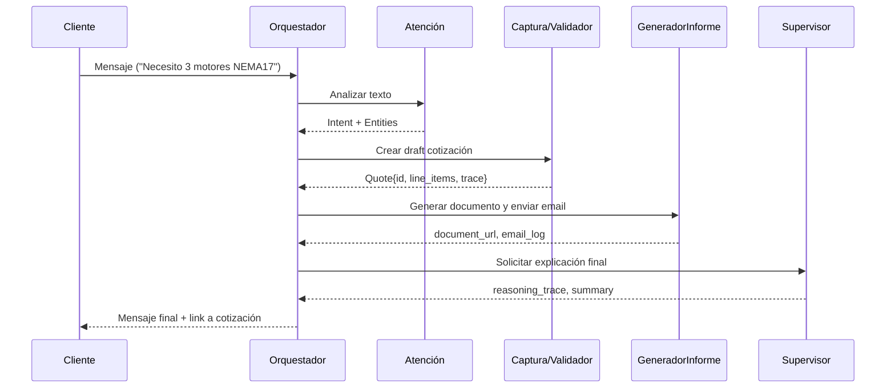

# **SE-FIUNVA — Sistema Experto FIUNVA**

---

## 📋 **Tabla de Contenidos**

### 🎯 Conceptos y Contexto
- [Resumen y Objetivo](#resumen)
- [Implementación de Firebase y Firestore](#implementación-de-firebase-y-firestore-en-se-fiunva)
- [Estructura del Sistema Experto](#estructura-fundamental-del-sistema-experto-se-fiunva)

### 📖 Manual de Usuario
- [1. Instalar el Sistema](#1-instalar-el-sistema)
- [2. Configurar Dependencias](#2-configurar-dependencias)
- [3. Ejecutar los Agentes](#3-ejecutar-los-agentes)
- [4. Conectar la Base de Datos](#4-conectar-la-base-de-datos)
- [5. Ejecutar Inferencias](#5-ejecutar-inferencias)
- [6. Utilizar Correctamente el Sistema](#6-utilizar-correctamente-el-sistema)

### 🆘 Troubleshooting y Referencia
- [Solución de Problemas Comunes](#troubleshooting-solución-de-problemas-comunes)
- [Comandos Útiles](#comandos-útiles-de-referencia-rápida)

### ⚙️ Especificaciones Técnicas
- [Definición y Tareas de Agentes](#definición-y-tareas-de-agentes)

---

## **Resumen**

- **Objetivo:** Desarrollar un sistema experto moderno basado en agentes inteligentes capaces de interactuar con clientes, realizar inferencias y automatizar procesos de venta o soporte mediante IA para proyectos de electrónica, software y robótica.

**Base de Conocimiento FIUNVA:**
- El sistema debe conocer, como mínimo, los siguientes dominios de conocimiento:
  - **Servicios:** Diseño PCB, Firmware embebido, ESP32, STM32, Arduino, sistemas IoT, automatización, robótica, diseño mecánico, impresión 3D e integración de sensores.
  - **Productos:** Prototipos, PCB, sistemas electrónicos y equipos de automatización.
  - **Clientes:** Universidades, empresas, emprendedores y makers.
  - **Proyectos:** Cotizaciones, seguimiento, desarrollo y entrega.

**Ingeniería del Conocimiento:**
- La base de reglas debe existir como conocimiento explícito y no solo como texto dentro de prompts.
- Ejemplos de reglas:
  - IF cliente solicita PCB THEN asignar área electrónica.
  - IF cliente solicita ESP32 THEN recomendar firmware embebido.
  - IF proyecto incluye IoT THEN agregar módulo nube.
  - IF cliente es recurrente THEN aplicar descuento.
  - IF tiempo estimado > 4 semanas THEN requerir anticipo.
- **Sugerencia de almacenamiento:** Colección `rules` en Firestore.

**Colecciones sugeridas en Firestore:**
- `users`
- `clients`
- `projects`
- `quotes`
- `rules`
- `knowledge_base`
- `conversations`

**Ejemplos de documentos:**
- `clients`:

```json
{
  "name": "Empresa XYZ",
  "type": "Empresa",
  "recurrent": true
}
```

- `projects`:

```json
{
  "title": "PCB Control Motores",
  "status": "Cotización"
}
```

- `rules`:

```json
{
  "id": "R001",
  "condition": "cliente_recurrente",
  "action": "descuento_10"
}
```

- `knowledge_base`:

```json
{
  "service": "Diseño PCB",
  "estimated_hours": 40,
  "complexity": "Media"
}
```

**Requisito IMPORTANTE — GitHub:**
- **Obligatorio:** Subir el trabajo continuamente a GitHub con commits diarios y evidencia del desarrollo.
- **No se aceptará:** Repositorios con un solo commit, commits masivos al final o repositorios vacíos. El historial será parte de la evaluación.

**Entregables (obligatorios):**
- **1. Repositorio GitHub:** Código fuente, README (actual), instrucciones básicas y evidencia continua del desarrollo.
- **2. Documento PDF:** Nombre: `GG_registro_Proy.pdf`. Debe incluir: portada, objetivo, descripción del sistema, arquitectura, base de conocimiento, inferencias utilizadas, explicación de agentes, capturas del sistema, base de datos utilizada, herramientas usadas y conclusiones.
- **3. Manual de Usuario:** Incluir dentro del PDF un manual completo con instrucciones para instalar, configurar dependencias, ejecutar agentes, conectar base de datos, ejecutar inferencias y uso del sistema. Debe ser replicable desde cero.
- **4. Video demostrativo:** Subir a YouTube mostrando el proyecto, agregar enlace dentro del PDF.
- **5. Prototipado UI (entrega posterior):** Diseño UI/UX, prototipo, flujo de interacción, mockups o implementación visual.

**Requisitos Técnicos Mínimos (a demostrar):**
- Conexión a base de datos.
- Inferencias y reglas demostrables.
- Explicabilidad del razonamiento (registro/explicaciones generadas por el agente supervisor).
- Interacción usuario-sistema (chatbot o UI).
- Arquitectura funcional (cliente-servidor o local).

**Sugerencia de Stack Inicial (ejemplo práctico):**
- **Frontend:** React + Firebase Hosting.
- **Backend / Agentes:** Firebase Functions con Python o Node.js para orquestación.
- **Persistencia:** Firestore como base principal; alternativas permitidas: SQLite, PostgreSQL o MongoDB.
- **IA / Razonamiento:** Gemini 2.5 Flash y Gemini 2.5 Pro, con apoyo de LangChain si se requiere orquestación híbrida.
- **Motor de inferencia:** Reglas explícitas almacenadas en Firestore y aplicadas por un agente especializado.

## **Implementación de Firebase y Firestore en SE-FIUNVA**

Firebase es la plataforma cloud que se utiliza como soporte de infraestructura para el prototipo y la futura versión productiva del sistema. En SE-FIUNVA sirve como capa de autenticación, alojamiento web, funciones backend y conexión con la base de datos central.

- **Firebase Authentication:** se usa para identificar usuarios y separar el acceso por rol. En el proyecto esto permite distinguir entre `client`, `operator` y `admin`, y evita que un usuario modifique información que no le corresponde.
- **Firebase Hosting:** se usa para publicar la interfaz React del sistema experto, manteniendo una experiencia rápida y accesible desde navegador.
- **Firebase Functions:** se usa como capa de backend serverless para ejecutar lógica de negocio, orquestar agentes, validar reglas y exponer endpoints.
- **Firestore:** es la base de datos documental donde se almacenan perfiles, catálogo, órdenes, cotizaciones, reglas y trazas de inferencia.

Firestore es la base de datos NoSQL orientada a documentos dentro de Firebase. Se eligió porque encaja con un sistema experto de consulta rápida, colecciones separadas por dominio y documentos flexibles para `users`, `products` y `orders`.

**Uso de Firestore dentro del proyecto:**
- Guardar perfiles de usuario y su nivel de acceso.
- Guardar productos, componentes y servicios del catálogo técnico.
- Guardar órdenes y cotizaciones generadas por los agentes.
- Guardar reglas, trazas de inferencia y documentación relacionada con proyectos.

**Archivos que definen la integración:**
- `firebase-blueprint.json`: describe el esquema esperado de datos y las colecciones principales del proyecto.
- `firestore.rules`: define las reglas de seguridad y acceso para usuarios, catálogo y órdenes.

**Colecciones base usadas en el prototipo:**
- `/users`: perfiles de cliente, operador y administrador.
- `/products`: catálogo de componentes electrónicos y servicios de ingeniería.
- `/orders`: cola de cotizaciones, aprobaciones y rechazos.

**Flujo de implementación previsto con Firebase/Firestore:**
1. El usuario se autentica con Firebase Authentication.
2. La interfaz React consulta y actualiza datos a través de endpoints o funciones backend.
3. Los agentes generan una cotización, que se persiste en Firestore como documento `orders`.
4. El administrador revisa, aprueba o rechaza la orden desde la consola técnica.
5. Firestore Rules controlan qué rol puede leer, crear o actualizar cada colección.

**Reglas de seguridad y propósito:**
- Los clientes pueden consultar su información y crear solicitudes.
- El personal autorizado puede editar catálogo, revisar órdenes y cambiar estados.
- Las órdenes quedan como registros de auditoría y no se eliminan.
- Los cambios sensibles, como roles o niveles de acceso, quedan restringidos al personal interno.

**Por qué `firebase-applet-config.json` no está en el repositorio:**
- Ese archivo contiene parámetros de conexión y credenciales de la aplicación Firebase/Google, por lo que se trata como configuración local sensible.
- Mantenerlo fuera del control de versiones reduce el riesgo de exponer llaves, identificadores internos o datos de despliegue en GitHub.
- El repositorio incluye la estructura y la guía para generarlo, pero cada persona debe crear su propia configuración al clonar el proyecto y conectar su propio proyecto de Firebase.

**Cómo generar el archivo al clonar este repositorio:**
1. Crear un proyecto nuevo en Firebase Console.
2. Registrar una aplicación web dentro del proyecto Firebase.
3. Copiar el bloque de configuración que entrega Firebase al crear la app.
4. Crear en la raíz del repositorio un archivo llamado `firebase-applet-config.json`.
5. Pegar ahí la configuración de tu propio proyecto y completar los campos requeridos por la app.
6. Mantener ese archivo fuera de Git para evitar publicar credenciales.

**Plantilla de referencia para el archivo local:**

```json
{
  "firebase": {
    "apiKey": "TU_API_KEY",
    "authDomain": "tu-proyecto.firebaseapp.com",
    "projectId": "tu-proyecto",
    "storageBucket": "tu-proyecto.appspot.com",
    "messagingSenderId": "TU_SENDER_ID",
    "appId": "TU_APP_ID"
  }
}
```

**Notas importantes para el usuario nuevo:**
- No reutilices claves de otra persona ni copies el archivo de ejemplo de un proyecto distinto.
- Si cambias de proyecto Firebase, regenera el archivo con los datos correctos.
- Si el proyecto usa Firestore Rules o Authentication, revisa también que esas reglas correspondan a tu propio entorno.
- Si necesitas mantener un ejemplo sin secretos, usa un archivo de muestra como `firebase-applet-config.example.json` o documenta los valores en `.env.example`.

**Dinámica de acceso Cliente/Administrador por correo (App.tsx):**

En la implementación actual, el control de acceso entre interfaz de cliente e interfaz de administrador se hace con autenticación de Google y validación explícita de correo electrónico en el frontend.

- **Herramienta Google utilizada:** Firebase Authentication con `GoogleAuthProvider` y `signInWithPopup` para iniciar sesión.
- **Persistencia de sesión:** `onAuthStateChanged` sincroniza el estado de sesión y guarda el correo en `localStorage` (`fiunva_session_email`) para conservar continuidad entre recargas.
- **Regla de acceso administrativo:** solo el correo `a23110162@ceti.mx` puede activar la vista de administrador.
- **Bloqueo automático de privilegios:** si la sesión no coincide con el correo administrador, el sistema fuerza `activeRole = "client"`.
- **Conmutación de vista:** el cambio entre cliente/admin desde el header se habilita únicamente cuando la sesión autenticada es el correo administrador.

**Qué puede hacer cada interfaz según la sesión:**
- **Cliente (por defecto):** usar el chat multiagente, solicitar cotizaciones, registrarse/validarse y consultar su flujo.
- **Administrador (correo autorizado):** acceder a subtabs de consola (`quotes`, `catalog`, `collections`, `clients`) para operar cotizaciones, catálogo, colecciones y directorio de clientes.

**Relación con base de datos y servicios utilizados:**
- **Google/Firebase Auth:** decide identidad y rol operativo de la interfaz.
- **Firestore (cuando está habilitado en backend):** persiste principalmente `products` y `orders`, y sincroniza datos con la app.
- **Capa REST del backend (`server.ts`):** la interfaz consume endpoints como `/api/products`, `/api/orders`, `/api/chat` y operaciones administrativas (aprobar/rechazar, editar catálogo, reset).
- **Fallback local:** si no existe configuración Firebase local, el backend opera en memoria temporal para permitir pruebas del flujo.

**Nota técnica importante:**
- La regla por correo es un control operativo del prototipo (MVP). Para producción se recomienda mover esta autorización a reglas centralizadas por rol en Firebase/Firestore (claims, reglas y validación en backend), evitando depender solo de lógica del frontend.

**UI/UX en desarrollo:**
- La interfaz actual está construida en React con Vite y un sistema visual responsivo pensado para operación local y futura conexión con Firestore/Firebase.
- El diseño usa modo claro/oscuro, tipografías limpias y un estilo de consola técnica para comunicar que el sistema es una herramienta de ingeniería y no un chatbot genérico.
- La navegación principal se divide en dos experiencias: **vista de cliente** y **consola de administrador**.
- En la **vista de cliente** se trabaja un chat de consultas con mensajes tipo burbuja, sugerencias rápidas, validación de cliente registrado, selección de tipo de cliente y despliegue del estado de la interacción en tiempo real.
- La sección de cliente permite simular el flujo de atención, captura de solicitud, respuesta automática y explicación del sistema experto.
- En la **consola de administrador** se concentra el control operativo del sistema: bandeja de cotizaciones, directorio técnico del catálogo, visualizador de colecciones y flujo de agentes.
- La consola administrativa está pensada para auditar solicitudes, aprobar o rechazar cotizaciones, ajustar tarifas, editar referencias técnicas y revisar documentos persistidos.
- El componente de **flujo de agentes** muestra el razonamiento paso a paso de Atención al Cliente, Generador de Pedido y Supervisor Explicador.
- El componente de **bandeja de cotizaciones** permite inspeccionar el historial, detalle de componentes, descuentos, impuestos y trazabilidad de inferencias.
- El componente de **directorio técnico** permite mantener el catálogo maestro de componentes y servicios, incluyendo edición de nombres, precios, descripciones y enlaces de referencia web.
- El componente de **visualización de base de datos** expone colecciones tipo Firestore en formato legible para fortalecer la trazabilidad y el entendimiento técnico del sistema.
- La experiencia actual también contempla estados de cliente nuevo, integrado y registrado, con validación simple de código de cliente y descuentos diferenciados.
- A nivel visual, la interfaz está orientada a una presentación de consultoría tecnológica: limpia, técnica, densa en información útil y enfocada en explicar decisiones.
- Esta capa UI/UX debe verse como prototipo funcional y base de la futura entrega de prototipado visual, mockups y refinamiento de interacción.

**Informe de prototipado y diseño de interfaz:**

El prototipado del Sistema Experto FIUNVA se planteó como una fase previa a la implementación definitiva para validar la navegación, la jerarquía de la información y la interacción entre cliente y administrador antes de consolidar la capa de producción. La prioridad fue convertir ideas abstractas en una interfaz tangible, útil para revisar la experiencia del usuario, detectar fricción temprana y mantener coherencia entre el discurso técnico del proyecto y su comportamiento visual.

**Objetivo del prototipado:**
- Reducir el costo de cambio detectando problemas de flujo antes de la entrega final.
- Validar que el modelo mental del usuario coincida con la lógica del sistema experto.
- Alinear al equipo de desarrollo con una misma referencia visual y funcional.
- Confirmar que las interacciones principales se puedan traducir a lógica real en React y backend.

**Criterio de diseño adoptado:**
- Se eligió una estética industrial y sobria, con contraste controlado, para reforzar el carácter técnico de FIUNVA.
- Se priorizó una interfaz de alta legibilidad, con tipografía clara y componentes visuales que separan con precisión las áreas de consulta, administración y auditoría.
- Se evitó el enfoque de maqueta estática; la interfaz se desarrolló como prototipo vivo para probar acciones reales sobre datos, catálogo y cotizaciones.

**Justificación tecnológica del prototipado en código:**
- En este proyecto, el prototipado se realizó directamente sobre la base de una aplicación React con servidor Express, por lo que la interfaz no solo muestra pantallas, sino que ejecuta lógica real.
- Este enfoque permite validar formularios, filtros, cambios de estado, consultas de catálogo y auditoría sin depender de diagramas desconectados del sistema.
- La ventaja principal es que el diseño visual y la lógica funcional evolucionan juntos, reduciendo la brecha entre diseño y desarrollo.

**Flujo de planificación de interfaz:**

```text
[Definición de Requerimientos] -> [Maquetación de Arquitectura] -> [Identidad Visual y Tipografía] -> [Iteración y Validación de Roles]
```

**Estructura visual del prototipo:**
- **Vista de cliente:** chat de consultas, preguntas rápidas, estado de registro y respuesta automática.
- **Vista de administrador:** consola técnica con bandeja de cotizaciones, directorio de catálogo y visualización de colecciones.
- **Flujo de agentes:** panel de estado con el razonamiento de Atención al Cliente, Generador de Pedido y Supervisor Explicador.
- **Base de datos visual:** explorador de colecciones con documentos en formato legible.

**Galería de prototipado:**

**1. Vista de cliente - captura 1**


**2. Vista de cliente - captura 2**


**3. Adaptación móvil de la experiencia del cliente**


**4. Consola de administrador - captura 1**


**5. Consola de administrador - captura 2**


**Conclusión del prototipado:**
- El prototipo demuestra que FIUNVA puede operar como una plataforma de consultoría tecnológica con una experiencia de usuario clara y diferenciada por roles.
- La interfaz ya comunica la identidad del sistema experto y permite validar el flujo básico de atención, administración y auditoría.
- Esta versión prototípica sirve como base para la entrega de UI/UX final, documentación visual y refinamiento de interacción.

**Estructura recomendada del repositorio:**
- **/src:** Código fuente de agentes y servicios.
- **/data:** Esquemas y dumps de bases de datos o datasets.
- **/docs:** Documento `GG_registro_Proy.pdf`, manual y capturas.
- **/notebooks:** Pruebas exploratorias o notebooks de experimentación.
- **/ui:** Prototipos Streamlit/Gradio o frontend web.
- **requirements.txt / pyproject.toml:** Dependencias.

**Guía rápida para ejecutar local (resumen):**
1. Clonar repo y crear entorno virtual:

```bash
git clone <repo-url>
cd <repo>
python -m venv .venv
source .venv/bin/activate
pip install -r requirements.txt
```

2. Inicializar base de datos (ejemplo SQLite):

```bash
python src/scripts/init_db.py  # Script que crea tablas y datos iniciales
```

3. Levantar servidor / agentes:

```bash
uvicorn src.main:app --reload  # Si se usa FastAPI
streamlit run ui/app.py        # Si se usa Streamlit para demo
```

4. Probar flujo: enviar mensaje de cliente → Agente Atención procesa → Generador crea pedido → Supervisor explica y valida.

**MVP sugerido por fases:**
- **Sprint 1:** GitHub, Firebase, React y login.
- **Sprint 2:** Agente de atención al cliente.
- **Sprint 3:** Motor de inferencia.
- **Sprint 4:** Generación de cotizaciones.
- **Sprint 5:** Supervisor explicable.

**Arquitectura final recomendada:**

```text
CLIENTE
  │
  ▼
React Web App
  │
  ▼
Firebase Hosting
  │
  ▼
Firebase Functions
  │
  ├──────────────┬──────────────┬──────────────┐
  ▼              ▼              ▼              ▼
Customer      Inference      Proposal      Supervisor
 Agent          Agent          Agent          Agent
  │              │              │              │
  └──────────────┴──────────────┴──────────────┘
              │
              ▼
            Gemini
              │
              ▼
          Firestore
              │
       ┌─────────┼─────────┐
       ▼         ▼         ▼
     Rules     Projects    Clients
```

**Qué debe demostrar el sistema:**
- Conexión a base de datos real.
- Inferencias trazables.
- Explicabilidad de decisiones.
- Interacción usuario-sistema.
- Arquitectura funcional cliente-servidor o local.


## **Estructura fundamental del Sistema Experto SE-FIUNVA**

El Sistema Experto FIUNVA está construido sobre cuatro pilares arquitectónicos que trabajan en conjunto para procesar solicitudes técnicas y generar recomendaciones de ingeniería de forma automatizada. A continuación se describe cada componente y su rol en el flujo de inferencia.

**1. La Base de Hechos (Fact Base)**

La **Base de Hechos** constituye la información dinámica y variable del sistema en un momento determinado. Es el "estado actual del mundo" que el sistema procesa. En FIUNVA, está integrada por:

- **El Mensaje del Cliente:** El requerimiento, idea o texto en lenguaje natural provisto por el usuario (por ejemplo: "Quiero armar un robot seguidor de líneas con dos motores paso a paso...").
- **El Estado del Inventario Local:** El nivel actual de stock de los productos almacenados en Firestore al momento de hacer la consulta.
- **La Divisa de Cotización Activa:** Si el usuario está operando en pesos mexicanos (**MXN**), dólares (**USD**) o euros (**EUR**).
- **Los Tipos de Cambio del Día:** La tasa de cambio en tiempo real registrada en el sistema (consultada vía Er-API o tasas de respaldo locales).
- **El Historial de Pedidos y Perfil de Usuario:** Si el cliente está autenticado, su rol (cliente, operador o administrador) y las cotizaciones previas.

---

**2. Base de Conocimiento (Knowledge Base)**

Es el repositorio que almacena el conocimiento estructurado del dominio de la robótica, electrónica y software. Se divide en dos vertientes:

**Datos del Experto (El Catálogo Técnico):**
- La lista de componentes disponibles junto con sus metadatos (ID del producto, descripción técnica, stock de seguridad mínimo, precio de referencia, y enlaces a distribuidores globales como Mouser, Pololu o DigiKey).
- Cada producto contiene propiedades técnicas que facilitan la inferencia: categoría (electrónica, robótica, servicios), unidad de medida (pieza, hora, servicio) y referencias web verificadas.

**Reglas del Experto (Las Heurísticas de Negocio e Ingeniería):**
- **Reglas de Ingeniería / Compatibilidad:** "Si el usuario cotiza un motor paso a paso de tipo `motor_nema17` pero no incluye su controlador `driver_drv8825`, el sistema infiere un riesgo operativo y exige proactivamente agregar el driver."
- **Reglas de Integración de Servicios:** "Si se detectan elementos complejos como microcontroladores (`arduino_uno` o `esp32_nodemcu`), se proponen servicios profesionales de ingeniería FIUNVA (desarrollo de software o diseño express de PCB)."
- **Reglas Comerciales/Descuentos:** Lógicas volumétricas de precios (cálculo de IVA del 16%, tarifas de exportación de precios Mouser, y descuentos porcentuales según la escala del proyecto y el nivel de cliente).

---

**3. Motor de Inferencia (Inference Engine)**

Es el procesador lógico que evalúa la **Base de Hechos** frente a la **Base de Conocimiento** para extraer deducciones y sugerencias avanzadas. FIUNVA opera con un **motor de inferencia de dos capas (doble vía)** para asegurar fiabilidad:

**Vía Principal (Inferencia Semántica con Gemini):**
- Un agente orquestador que analiza el texto del usuario para identificar intenciones semánticas y mapear componentes recomendados con un riguroso análisis de compatibilidad técnica.
- Consulta la Base de Conocimiento en tiempo real (stock, precios, compatibilidades).
- Genera un resumen de propuesta de pedido con explicación de las inferencias realizadas.

**Vía de Respaldo (Sistema Experto Local Determinista):**
- Si la API de IA no está disponible o el operador trabaja sin conexión, entra en acción una función lógica local en TypeScript (ej: `simulateExpertSystem`).
- Este motor ejecuta un procesamiento basado en reglas clásicas: escanea patrones en el texto, calcula discrepancias de voltajes/componentes adicionales y genera las advertencias adecuadas de manera determinista.
- Garantiza que el sistema permanezca funcional incluso sin acceso a servicios cloud.

---

**4. Interfaz de Usuario (User Interface)**

La interfaz actúa como el puente bidireccional que permite la interacción fluida entre el sistema de expertos humanos (operadores), los clientes y la máquina:

**Punto de Entrada del Cliente (La Sala de Chat):**
- Permite al usuario interactuar en lenguaje informal, como si estuviera hablando de forma presencial con un ingeniero consultor técnico.
- Acepta consultas en texto libre, extrae intenciones automáticamente y devuelve propuestas técnicas con precios convertidos a la divisa elegida.
- Visualiza el estado de cotizaciones, sugerencias de compatibilidad y explicaciones paso a paso del razonamiento del sistema.

**Visualizador y Explorador de Firestore Activo:**
- Diseñado con altos estándares de usabilidad, permite a los administradores visualizar el estado interno y el comportamiento lógico del sistema experto.
- Expone la **bitácora de razonamiento** generada por los agentes, mostrando qué reglas fueron aplicadas y por qué.
- Permite **cargar y descargar la base de datos completa en archivos JSON** para auditorías locales rápidas y respaldos operacionales.

**Portal de Operador (Consola Técnica):**
- Una sección ágil donde los ingenieros humanos auditan, reajustan precios, aprueban la viabilidad técnica sugerida por la suite de agentes o rechazan solicitudes.
- Retroalimentación activa: los operadores pueden rechazar propuestas y el sistema aprende de ello para futuras interacciones.
- Visualización de colecciones Firestore en tiempo real: `products`, `orders`, `users`, `rules`.

---

## **Manual de Usuario SE-FIUNVA: Guía Práctica para Instalar, Configurar y Usar el Sistema**

Este manual está diseñado para que cualquier usuario pueda clonar el repositorio, configurar el entorno local y usar el sistema experto desde cero. Incluye instrucciones paso a paso, ejemplos prácticos y soluciones a problemas comunes.

---

### **1. Instalar el Sistema**

#### **Requisitos previos**
Asegúrate de tener instalados en tu computadora:
- **Node.js 18 o superior**: Descarga desde [nodejs.org](https://nodejs.org)
- **npm** (incluido con Node.js)
- **Git**: Descarga desde [git-scm.com](https://git-scm.com)

#### **Pasos de instalación**

1. **Clonar el repositorio**
   ```bash
   git clone https://github.com/AAD23110162/SE_FIUNVA.git
   cd SE_FIUNVA
   ```

2. **Verificar la estructura del proyecto**
   ```bash
   ls -la
   ```
   Deberías ver carpetas como `src/`, `Imagenes/`, archivos como `package.json`, `server.ts`, `README.md`, etc.

3. **Instalar dependencias**
   ```bash
   npm install
   ```
   Este comando descarga todas las librerías necesarias (React, Express, Firebase, Gemini API, etc.) en la carpeta `node_modules/`.

4. **Verificación final**
   ```bash
   npm run lint
   ```
   Si la verificación es exitosa, verás un mensaje sin errores. El sistema está listo para configurar.

---

### **2. Configurar Dependencias**

#### **Configuración básica de variables de entorno**

1. **Copiar el archivo de ejemplo**
   ```bash
   cp .env.example .env
   ```

2. **Editar el archivo `.env`** (con un editor de texto como VS Code o nano)
   ```
   GEMINI_API_KEY="MY_GEMINI_API_KEY"
   APP_URL="MY_APP_URL"
   ```

   - **GEMINI_API_KEY** (Opcional pero recomendado): Obtén una clave API desde [Google AI Studio](https://aistudio.google.com/apikey). Sin ella, el sistema funcionará con un motor de inferencia local fallback.
   - **APP_URL** (Opcional): Por defecto es `http://localhost:3000` en desarrollo local.

#### **Configuración de Firebase (Opcional pero recomendado para persistencia)**

Si deseas que los datos se guarden en la nube (en lugar de solo en memoria local):

1. **Crear un proyecto en Firebase**
   - Ve a [Firebase Console](https://console.firebase.google.com)
   - Haz clic en "Crear proyecto"
   - Rellena el nombre del proyecto (ej: "SE-FIUNVA-LOCAL")
   - Acepta los términos y crea el proyecto

2. **Crear una aplicación web**
   - En la consola de Firebase, selecciona tu proyecto
   - Haz clic en "Configuración del proyecto" (rueda dentada)
   - Ve a la pestaña "Aplicaciones"
   - Haz clic en el icono web (`</>`), nómbrala (ej: "SE-FIUNVA Web") y registra

3. **Copiar la configuración**
   - Firebase mostrará un bloque de código con tu configuración
   - Copia los valores: `apiKey`, `authDomain`, `projectId`, `storageBucket`, `messagingSenderId`, `appId`

4. **Crear archivo de configuración local**
   ```bash
   nano firebase-applet-config.json
   ```
   Pega el siguiente contenido, reemplazando los valores con los tuyos:
   ```json
   {
     "firebase": {
       "apiKey": "TU_API_KEY_AQUI",
       "authDomain": "tu-proyecto.firebaseapp.com",
       "projectId": "tu-proyecto",
       "storageBucket": "tu-proyecto.appspot.com",
       "messagingSenderId": "TU_SENDER_ID",
       "appId": "TU_APP_ID"
     }
   }
   ```
   Guarda el archivo con `Ctrl+X` (en nano), luego `Y` y `Enter`.

5. **Habilitar Firestore**
   - En la consola de Firebase, ve a "Firestore Database"
   - Haz clic en "Crear base de datos"
   - Selecciona "Iniciar en modo prueba" (para desarrollo local)
   - Selecciona tu región más cercana y crea

6. **Habilitar Authentication**
   - En la consola, ve a "Authentication"
   - Haz clic en "Comenzar"
   - Activa "Google" como proveedor

#### **Confirmación de configuración**

Inicia el servidor para verificar que todo está configurado correctamente:
```bash
npm run dev
```

Si ves mensajes como "Firestore successfully connected" o "Operating with in-memory database fallback", la configuración es correcta.

---

### **3. Ejecutar los Agentes**

#### **Iniciar el servidor de desarrollo**

1. **Arranca el servidor**
   ```bash
   npm run dev
   ```

2. **Abre tu navegador**
   - Ve a `http://localhost:3000`
   - Deberías ver la interfaz web de SE-FIUNVA

3. **Entender lo que ves**
   - **Chat de cliente (vista por defecto):** Un área de chat donde puedes escribir solicitudes
   - **Flujo de Agentes (derecha o abajo):** Tres columnas que muestran el estado de cada agente
     - **Agente 1 (Atención al Cliente):** Interpreta tu mensaje y extrae intención
     - **Agente 2 (Planificador y Cotizador):** Valida disponibilidad y calcula precios
     - **Agente 3 (Supervisor Explicador):** Verifica y explica la propuesta final

#### **Enviar tu primer mensaje**

1. En el campo de chat, escribe un mensaje como:
   ```
   Quiero 3 motores NEMA17 y 2 drivers DRV8825 para un robot
   ```

2. Presiona "Enviar"

3. Observa cómo:
   - El **Agente 1** detecta que solicitas motores y drivers
   - El **Agente 2** busca esos productos en el catálogo, valida stock y calcula el total
   - El **Agente 3** genera un resumen y explica las reglas aplicadas (ej: "Se detectó compatibilidad obligatoria motor-driver")

---

### **4. Conectar la Base de Datos**

#### **Verificar que la BD está conectada**

1. **Sin Firebase (modo local)**
   - Los datos se guardan en memoria durante la sesión
   - Si reinicias el servidor, los datos se pierden
   - Mensajes en consola: "Operating with in-memory database fallback"

2. **Con Firebase (modo persistente)**
   - Los datos se guardan en Firestore en tiempo real
   - Si reinicias, los datos permanecen
   - Mensajes en consola: "Firestore successfully connected" y logs de sincronización

#### **Acceder a las colecciones de la BD (Modo Administrador)**

1. **Cambiar a vista de Administrador**
   - Si tienes el email `a23110162@ceti.mx`, haz clic en "Cambiar a Administrador" en el header (si no lo ves, requiere autenticación Google)
   - Alternativamente, puedes cambiar el email en el código de [src/App.tsx](src/App.tsx) línea ~120 para pruebas locales

2. **Ver las colecciones**
   - Ve a la pestaña "Colecciones" en la vista de Administrador
   - Haz clic en "Explorador de Firestore Activo"
   - Verás cuatro tabs: `users`, `products`, `orders`, `knowledge_base`

3. **Respaldar la BD (Descargar JSON)**
   - En la consola de Administrador, haz clic en "Descargar JSON"
   - Se descargará un archivo `snapshot_fiunva_firestore_AAAA-MM-DD.json` con todos los datos

4. **Restaurar la BD (Cargar JSON)**
   - En la consola de Administrador, haz clic en "Cargar JSON"
   - Selecciona un archivo JSON previamente descargado
   - Los datos se importarán y sincronizarán con Firestore

5. **Resetear la BD**
   - En la consola de Administrador, haz clic en "Restablecer DB"
   - La base de datos se reinicializará con datos por defecto

---

### **5. Ejecutar Inferencias**

#### **¿Qué es una inferencia?**

Una inferencia es el proceso mediante el cual el sistema analiza tu mensaje, consulta su base de conocimiento y genera una recomendación o cotización basada en reglas explícitas.

#### **Ejemplos prácticos de mensajes para probar**

**Ejemplo 1: Solicitud simple de componentes**
```
Necesito 2 motores NEMA17
```

**Resultado esperado:**
- Agente 1 detecta: "solicitud de 2 motores NEMA17"
- Agente 2 consulta catálogo, ve stock disponible (12 piezas), calcula precio
- Agente 3 propone: "Cotización generada: 2 × Motor NEMA17 = $37 USD. Stock confirmado."

---

**Ejemplo 2: Solicitud con compatibilidad**
```
Quiero controlar 3 motores paso a paso, ¿qué necesito?
```

**Resultado esperado:**
- Agente 1 detecta: "solicitud de controladores para motores paso a paso"
- Agente 2 infiere: "Si hay motores, falta driver". Sugiere automáticamente 3 × DRV8825
- Agente 3 explica: "Se agregó regla de compatibilidad: driver requerido para cada motor. Descuento por volumen aplicado."

---

**Ejemplo 3: Solicitud con servicios**
```
Necesito diseñar una PCB para controlar un ESP32 con sensores
```

**Resultado esperado:**
- Agente 1 detecta: "microcontrolador ESP32" + "diseño PCB"
- Agente 2 sugiere: 1 × ESP32 + servicio "Prototipado PCB Express"
- Agente 3 explica: "Se sugirió servicio profesional por complejidad del proyecto"

---

#### **Cambiar divisa**

1. En el header, verás un selector de divisa (USD, MXN, EUR)
2. Haz clic para cambiar
3. Los precios se recalculan automáticamente usando tasas de cambio en tiempo real (o locales si no hay conexión)

#### **Ver la bitácora de razonamiento (Admin)**

1. Ve a la vista de Administrador
2. Ve a la pestaña "Cotizaciones"
3. Haz clic en una orden
4. En la sección inferior "Hilo de Razonamiento", verás detalles como:
   - Qué reglas se aplicaron
   - Descuentos identificados
   - Advertencias de stock
   - Sugerencias técnicas

---

### **6. Utilizar Correctamente el Sistema**

#### **Roles y permisos**

**Rol: Cliente (por defecto)**
- Puedes enviar mensajes en el chat
- Recibes cotizaciones automáticas
- Ves tu historial de solicitudes
- No puedes editar el catálogo

**Rol: Administrador (email autorizado)**
- Acceso a todas las vistas de cliente
- Puedes editar catálogo (precios, disponibilidad)
- Ves todas las cotizaciones generadas
- Puedes aprobar, rechazar u observar órdenes
- Ves la BD completa y puedes importar/exportar datos
- Ejemplo email autorizado: `a23110162@ceti.mx` (puedes cambiarlo en el código)

#### **Flujo completo: De cliente a admin**

**1. Como Cliente**
```
→ Escribe en chat: "Necesito 5 servos SG90"
→ Recibes cotización: "5 × Servo SG90 = $17.50 USD"
→ El sistema guarda la solicitud como "pendiente de aprobación"
```

**2. Como Administrador**
```
→ Ve la pestaña "Cotizaciones"
→ Haz clic en la solicitud del cliente
→ Revisa detalles: items, precios, reglas aplicadas
→ Haz clic en "Aprobar" o "Rechazar"
→ La orden pasa a estado "approved" o "rejected"
```

#### **Mejores prácticas**

1. **Para clientes:**
   - Sé específico en tus solicitudes (ej: "3 motores NEMA17 de 1.8°" vs "3 motores")
   - Si el sistema sugiere componentes adicionales, es por compatibilidad técnica, no es obligatorio
   - Prueba diferentes divisas para comparar precios

2. **Para administradores:**
   - Revisa la "Bitácora de Razonamiento" para entender por qué el sistema sugirió algo
   - Utiliza "Rechazar" si la solicitud no es viable; esto ayuda al sistema a mejorar
   - Mantén el catálogo actualizado (`Catálogo` tab en Admin) para que los precios y stock sean correctos
   - Exporta la BD regularmente como respaldo (botón "Descargar JSON")

3. **General:**
   - Usa Google Sign-In para autenticación (más seguro que clave usuario/contraseña)
   - Si ves errores en el chat, revisa que GEMINI_API_KEY esté configurado o que haya conectividad
   - Si necesitas resetear todo, usa "Restablecer DB" en Admin → Colecciones

#### **Editar el catálogo (Administrador)**

1. Ve a la vista de Administrador
2. Haz clic en la pestaña "Catálogo"
3. Busca el producto que deseas editar
4. Haz clic en el producto para ver/editar:
   - Nombre
   - Descripción
   - Precio (en USD base)
   - Stock disponible
   - Enlace web de referencia
5. Guarda los cambios

#### **Aprobar/Rechazar cotizaciones**

1. Ve a la vista de Administrador
2. Haz clic en "Cotizaciones"
3. Filtra por estado: "Pendientes", "Aprobados", "Declinados"
4. Selecciona una cotización
5. Revisa los detalles en el panel derecho
6. Haz clic en "Aprobar" (verde) o "Rechazar" (rojo)
7. La cotización cambia de estado y el cliente recibe una notificación interna

---

### **Troubleshooting: Solución de Problemas Comunes**

#### **Error: "Puerto 3000 ya está en uso"**
```
Error: listen EADDRINUSE :::3000
```
**Solución:**
```bash
# Opción 1: Usar otro puerto
PORT=3001 npm run dev

# Opción 2: Matar el proceso que usa el puerto 3000 (en Linux/Mac)
lsof -ti:3000 | xargs kill -9

# Opción 3: En Windows
netstat -ano | findstr :3000
taskkill /PID <PID> /F
```

---

#### **Error: "GEMINI_API_KEY inválida"**
```
Error: API key not valid. Please pass a valid API key.
```
**Solución:**
1. Verifica que el archivo `.env` exista y contenga una clave válida
2. Obtén una clave desde [Google AI Studio](https://aistudio.google.com/apikey)
3. Sin una clave válida, el sistema usará el motor local fallback automáticamente (respuestas más básicas)

---

#### **Error: "firebase-applet-config.json no encontrado"**
```
Warning: firebase-applet-config.json not found. Operating with in-memory database fallback.
```
**Explicación:** Es normal. Significa que no configuraste Firebase o no creaste el archivo.

**Opciones:**
- **Si deseas persistencia en Firestore:** Crea el archivo siguiendo la sección "Configurar Dependencias → Firebase"
- **Si solo quieres pruebas locales:** Ignora este mensaje. Los datos se guardan en memoria durante la sesión

---

#### **Error: "Firestore connection failed"**
```
Failed to initialize or seed Firestore: Error: permission denied
```
**Soluciones:**
1. Verifica que el archivo `firebase-applet-config.json` tenga las credenciales correctas
2. En Firebase Console, asegúrate de que Firestore está habilitado
3. Comprueba las Firestore Rules: ve a [firestore.rules](firestore.rules) y copia el contenido a Firebase Console

---

#### **Error: "Google Sign-In no funciona"**
```
Error: popup closed by user or blocked by pop-up blocker
```
**Soluciones:**
1. Desactiva el bloqueador de ventanas emergentes (pop-up blocker) en tu navegador
2. Usa una incógnita/pestaña privada del navegador
3. Si estás en un iframe (como AI Studio), abre la app en una pestaña nueva

---

#### **El chat no responde o tarda mucho**
**Causas posibles:**
- Sin GEMINI_API_KEY: el sistema usa inferencia local (más lenta pero no requiere API)
- Conexión lenta: Firestore tarda en sincronizar
- Overload del servidor: muchas solicitudes simultáneas

**Soluciones:**
1. Agrega GEMINI_API_KEY al `.env` para acelerar respuestas
2. Espera unos segundos antes de enviar otro mensaje
3. Reinicia el servidor: `npm run dev`

---

#### **Datos no se guardan (pierdo todo al reiniciar)**
**Causa:** No tienes Firebase conectado.

**Solución:**
1. Configura Firebase siguiendo "Configurar Dependencias → Firebase"
2. Crea el archivo `firebase-applet-config.json`
3. Reinicia el servidor: `npm run dev`

Si ves "Firestore successfully connected" en los logs, ya está guardando en la nube.

---

#### **¿Cómo cambio el email del administrador?**
**Archivo:** [src/App.tsx](src/App.tsx), línea ~120

Busca:
```typescript
if (email === "a23110162@ceti.mx") {
  setActiveRole("admin");
}
```

Reemplaza con tu email:
```typescript
if (email === "tu-email@ejemplo.com") {
  setActiveRole("admin");
}
```

Guarda y reinicia el servidor.

---

#### **¿Dónde están guardados los datos sin Firebase?**
Los datos se guardan en memoria local durante la sesión. Si deseas persistencia local sin Firestore:
- **Archivo de clientes:** `server_clients.json`
- **Archivo de personal:** `server_staff.json`

Estos archivos se actualizan cuando cambias catálogo, órdenes o usuarios en modo local.

---

### **Comandos Útiles de Referencia Rápida**

```bash
# Iniciar en desarrollo
npm run dev

# Compilar para producción
npm build

# Iniciar versión compilada
npm start

# Verificar sintaxis TypeScript
npm run lint

# Limpiar archivos compilados
npm run clean
```

---

### **Conclusión del Manual**

¡Has completado la guía! Ahora puedes:
- ✅ Instalar y ejecutar el sistema localmente
- ✅ Configurar Firestore (opcional) para persistencia
- ✅ Enviar mensajes y recibir cotizaciones automatizadas
- ✅ Usar la consola de administrador para auditar decisiones
- ✅ Respaldar y restaurar datos
- ✅ Resolver problemas comunes

**Para más detalles técnicos**, ve a la sección "Definición y tareas de agentes" o consulta el código en [server.ts](server.ts) y [src/App.tsx](src/App.tsx).

---

## **Definición y tareas de agentes**

La siguiente sección describe propiedades, dependencias y tareas mínimas para los agentes del sistema SE-FIUNVA.

- **Agente — Atención al Cliente**
  - Propósito: Punto de entrada conversacional (NLU, extracción de slots, clasificación de intención y enrutado).
  - Propiedades: `id`, `name`, `channel` (Telegram/WhatsApp/Web), `language`, `session_id`, `last_interaction`, `intent`, `entities`, `confidence`, `context_window`, `policy_threshold`.
  - Dependencias: modelo NLU (Gemini/LLM), colección `conversations`, colección `clients`, colección `rules`.
  - Tareas: recibir mensaje → detectar intención → extraer entidades/slots → completar o pedir clarificación → crear draft en `quotes` (si es cotización) o ticket (si es soporte) → enrutar al agente correspondiente.
  - Reglas: si `confidence` < threshold → pedir confirmación humana; detectar urgencia → marcar prioridad.
  - Salida: entrada en `conversations` con `intent`, `entities` y `explanation` (IDs de reglas usadas).

- **Agente — Captura y Validación de Datos de Cotización**
  - Propósito: Recoger y validar todos los datos necesarios para una cotización técnica y su factibilidad.
  - Propiedades: `quote_id`, `status` (draft/validated/rejected), `required_fields` (client_id, items[], qty, deadline, budget), `validation_errors`, `validator_confidence`, `related_conversation`.
  - Dependencias: `knowledge_base`, `rules`, `inventory`, `clients`, motor de inferencia.
  - Tareas: recibir draft → validar campos obligatorios → chequear stock/compatibilidad/lead-times → aplicar reglas (descuentos, requisitos de anticipo) → estimar horas y costos base → marcar `validated` o devolver aclaraciones.
  - Persistencia: guardar versiones en `quotes` y enlazar a `projects` si avanza a pedido.
  - Salida: `quotes/{quote_id}` con `line_items`, `cost_estimate` y `inference_trace`.

- **Agente — Generador de Informe de Cotización y Envío**
  - Propósito: Crear documento formal (PDF/HTML) de cotización con explicaciones y enviarlo por correo para revisión y validación.
  - Propiedades: `quote_id`, `template_id`, `document_url`, `email_status` (pending/sent/failed), `expiry`, `signed_token`.
  - Dependencias: `quotes`, `documents` storage (Cloud Storage), motor de templating/PDF, servicio de correo (SMTP/SendGrid), `Supervisor` para explicabilidad.
  - Tareas: obtener `quote` validada → generar documento con `inference_trace` → crear PDF y attachments técnicos → enviar email con enlace seguro y `approval_link` → actualizar `quotes.status` y registrar `email_log`.
  - Seguridad: enlaces firmados y expirables; reintentos de envío y notificación de bounce.
  - Salida: registro en `documents` y log de envío.

- **Agente — Gestor de Documentación de Proyectos**
  - Propósito: Controlar acceso y responder consultas semánticas sobre documentación del proyecto usando código de pedido como autenticación mínima.
  - Propiedades: `project_id`, `docs[]` (metadatos), `access_codes`, `permissions`, `vector_index_ref`, `version`, `access_log`.
  - Dependencias: `projects`, `documents` collection, embeddings store / vector DB, Firestore, pipeline RAG.
  - Tareas: solicitar `pedido_code` → verificar permisos → recuperar documentos relevantes → realizar búsqueda semántica → devolver snippets citados con referencias y explicación del origen → registrar acceso.
  - Seguridad: expiración de códigos, rate limiting, auditoría de accesos.

**Arquitectura de interacción entre agentes**

Los agentes no son procesos aislados: constituyen una orquesta coordinada por un bus de mensajes y/o llamadas HTTP internas. La interacción está diseñada para ser modular, asíncrona y trazable.

- Orquestador (coordina por defecto): un componente ligero en `Firebase Functions` o el `server.ts` en prototipo que recibe la entrada del usuario y distribuye tareas a los agentes.
- Canal de comunicación: JSON sobre HTTP (API internas) o mensajes en cola (Pub/Sub) para producción.
- Persistencia intermedia: cada paso importante escribe en colecciones (`conversations`, `quotes`, `orders`, `documents`) con `correlation_id` para trazabilidad.

Flujo general (resumen):
1. Cliente envía mensaje → Orquestador recibe y crea `conversation`.
2. Orquestador invoca **Agente Atención al Cliente** para NLU y extracción de slots.
3. Resultado → guarda `conversation` y notifica a **Agente Captura/Validación** con `correlation_id`.
4. **Agente Captura/Validación** aplica reglas, consulta `inventory` y `knowledge_base`, luego genera un `quote` preliminar y escribe `quotes/{id}`.
5. **Agente Generador de Informe** toma `quotes/{id}`, crea documento (PDF/HTML) y envía email con `approval_link`.
6. **Agente Supervisor** revisa `inference_trace`, genera explicación legible y actualiza `quotes.{id}.status`.
7. Si se aprueba, orquestador invoca la rutina de aprobación que deduce stock y crea/actualiza `orders`.

**Protocolo de mensajes (json mínimo entre agentes)**

```json
{
  "correlation_id": "ORD-1234",
  "source_agent": "agent1",
  "target_agent": "agent2",
  "payload": {
    "client": { "id": "usr-001", "tier": "vip" },
    "extracted_items": [{ "productId": "motor_nema17", "qty": 3 }]
  },
  "explanation": ["R_TIER_15","R_VOLUME_10"]
}
```

Cada agente debe devolver al orquestador un objeto con: `status` (ok|fail), `data` (resultado), `inference_trace` (lista de reglas aplicadas) y `errors` (si existen).

**Secuencia típica: Cotización automatizada**



**Reglas de negocio y escalado**

- Si `confidence` del NLU < 0.6 → Agente Atención solicita aclaración al cliente y la interacción queda en estado `awaiting_clarification`.
- Si Agente Captura detecta `stock < qty` → añade `stockWarning` en `quote` y marca `requires_restock`.
- Si `quote.total > threshold_autovalidation` → marcar `requires_manual_approval` y notificar operador.
- Errores transversales: si un agente falla por timeout o excepción, el orquestador guarda `automation_error` y encola notificación a un canal humano (email/Slack) y responde al cliente con un mensaje amable.

**Trazabilidad y explicabilidad (requisitos operativos)**

- `inference_trace` debe incluir: `rule_id`, `description`, `input_snapshot`, `timestamp`, `agent_id`.
- Todos los mensajes deben incluir `correlation_id` y un `parent_id` para reconstruir el grafo de decisiones.
- Guardar un `audit_log` por cada transición crítica (creación de quote, envío de email, aprobación/rechazo).

**Ejemplo de `inference_trace` (estructura)**

```json
[
  {"rule_id":"R014","desc":"Si motores>4 -> sugerir driver dedicado","agent":"agent2","ts":"2026-06-01T12:10:00Z"},
  {"rule_id":"R_TIER_15","desc":"Cliente VIP -> 15% descuento","agent":"agent2","ts":"2026-06-01T12:10:01Z"}
]
```

Con esto la cadena de decisiones es inspeccionable por humanos y reproducible en auditoría.

**Requisitos transversales entre agentes**
- Trazabilidad y explicabilidad: todas las acciones deberán incluir un `inference_trace` con IDs de reglas y pasos de inferencia, almacenado en las colecciones relevantes.
- Formato de mensajes entre agentes: JSON estandarizado con `source_agent`, `target_agent`, `payload`, `correlation_id`, `explanation`.
- Persistencia mínima: colecciones `conversations`, `quotes`, `projects`, `rules`, `documents`, `access_logs`, `inventory`.
- Seguridad: autenticación (Firebase Auth / JWT), autorización por roles, tokens y enlaces firmados para recursos sensibles.
- Monitoreo: logs de errores, métricas de latencia, tasa de escalado a humano y tasa de validación automática.
- Pruebas sugeridas: flujo completo de cotización, acceso a docs con código inválido/válido, envío de correo fallido y reintentos.

--
--